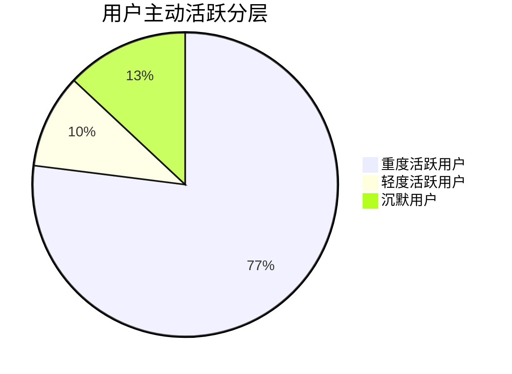
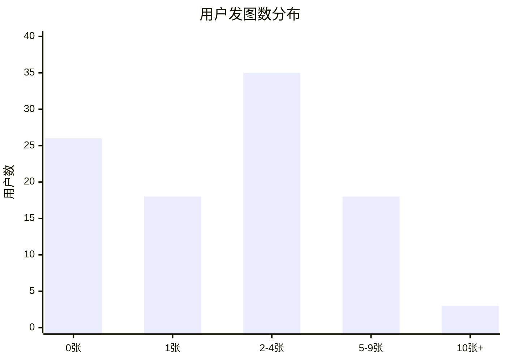
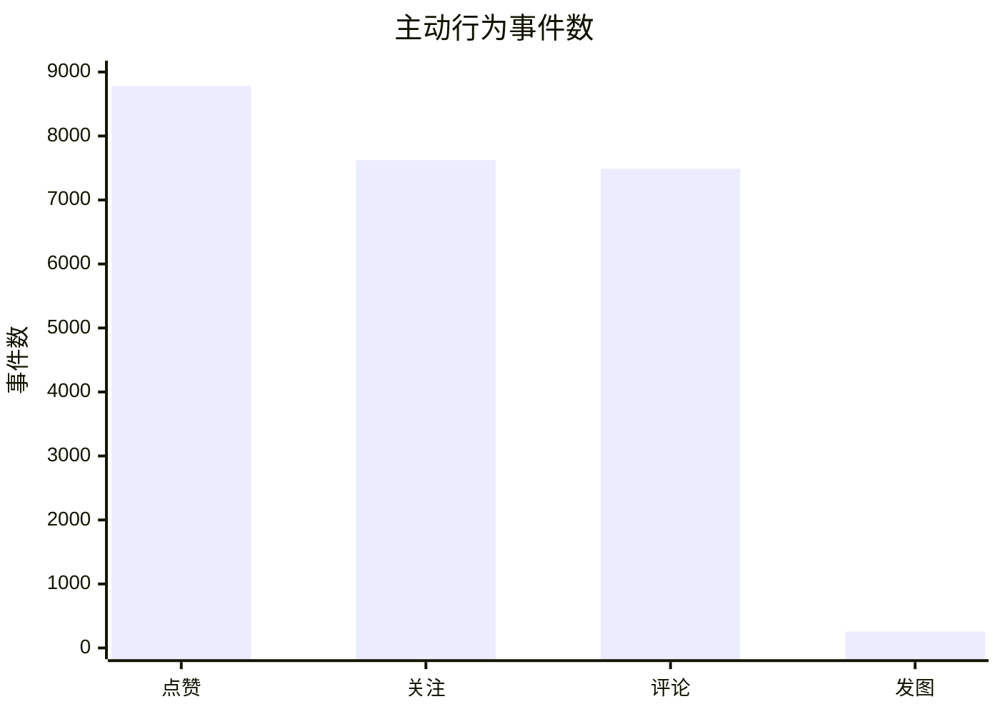
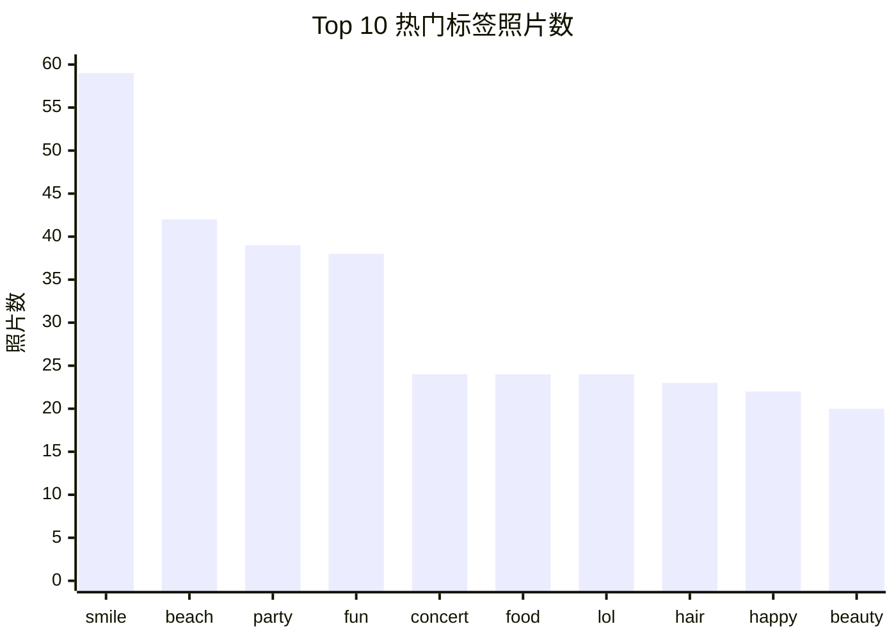

# Instagram 用户数据分析报告

## Executive Summary

- **用户池规模小但互动密度高。** 数据集中包含 100 个用户、257 张照片、8,782 次点赞、7,488 条评论和 7,623 条关注；77% 的用户属于重度主动互动层。
- **主要风险是内容供给，不是社交连接。** 所有用户都至少被关注过，且每人收到 76-77 个关注；但 26% 的用户没有发图，13% 的用户没有任何主动行为。
- **内容一旦发布就能带来互动。** 平均每张照片获得 34.17 次点赞和 29.14 条评论，说明消费意愿强，短板在首次发布和持续发布。
- **建议优先激活创作者。** 先转化 26 个零发图用户和 18 个仅发 1 张照片的用户，再优化标签和热门内容推荐。

## 报告范围与口径

本报告使用开源项目 [tushar2704/Instagram-User-Analytics](https://github.com/tushar2704/Instagram-User-Analytics) 提供的原始 CSV 数据，并在 MySQL 中进行分析。

用户注册时间覆盖 2016 年 5 月 6 日至 2017 年 5 月 4 日；照片、点赞、评论和关注事件时间戳集中在 2026 年 3 月 1 日。因此，互动指标更适合作为一次数据快照解读，不适合作为连续周趋势或自然月趋势。

主动活跃用户指至少发生过发图、点赞、评论或关注任一行为的用户。

## 1. 用户增长：注册增长稳定，但更适合看存量经营

2016 年 5 月至 2017 年 4 月，每月新增用户大多在 6-12 人之间，没有明显断崖或爆发。

由于样本只有 100 人，单纯观察新增用户规模的意义有限。相比增长趋势，更值得关注的是这些用户是否完成激活、是否持续贡献内容、以及互动是否集中在少数用户身上。

**业务含义：** 当前数据更适合用于用户健康度、活跃分层和内容供给分析，而不是用于判断真实市场增长速度。

## 2. 用户活跃：77% 用户高度活跃，但 13% 完全沉默

用户活跃结构呈现明显两极：

- 77 个用户属于重度主动互动层，累计贡献 24.1k 次主动事件。
- 10 个用户属于轻度活跃层。
- 13 个用户没有发图、点赞、评论或关注。

这说明平台已经有一批强互动核心用户，但沉默用户仍然需要单独处理。否则，整体活跃水平会被重度用户拉高，从而掩盖一部分用户没有被真正激活的问题。

**业务含义：** 后续运营不应只看总互动量，还应该同时监控沉默用户占比、首次发图率和轻度用户向中高活跃用户的转化。

## 3. 内容供给：内容生产是最大的用户转化空间

在 100 个用户中：

- 74 个用户至少发过 1 张照片。
- 26 个用户完全没有发图。
- 18 个用户只发过 1 张照片。
- 只有 3 个用户发布了 10 张及以上照片。

内容生产明显弱于内容消费。虽然发图用户占比不低，但持续发图用户很少，说明平台内容供给可能依赖少量创作者。

**业务含义：** 应优先降低首次发布和二次发布门槛，例如提供发布模板、热门标签提示、发布奖励或新手任务。

## 4. 内容互动：照片一旦发布，就能获得较高互动

单张照片平均表现：

- 平均点赞数：34.17
- 平均评论数：29.14
- 平均总互动数：63.31

这说明用户对内容的消费和互动意愿较强。平台的问题不是内容没人看，而是内容供给不足。

**业务含义：** 提升内容发布量可能比单纯优化点赞或评论入口更有价值。只要更多用户开始发布内容，就有机会带动更多互动。

## 5. 主动行为构成：消费互动远强于发图频率

主动行为分布如下：

| 行为类型 | 事件数 | 活跃用户数 | 每活跃用户事件数 |
| --- | ---: | ---: | ---: |
| 点赞 | 8,782 | 77 | 114.05 |
| 关注 | 7,623 | 77 | 99.00 |
| 评论 | 7,488 | 77 | 97.25 |
| 发图 | 257 | 74 | 3.47 |

点赞、评论和关注都由同一批 77 个活跃用户大量贡献；相比之下，发图频率明显偏低。

**业务含义：** 社区不是缺互动意愿，而是缺持续内容供给。运营策略应从“提升互动”转向“激活创作者”。

## 6. 高价值用户：内容影响者和互动推动者应分开运营

按入站影响力看，Eveline95、Clint27、Cesar93 等用户通过较多照片获得大量点赞和评论。

| 用户 | 照片数 | 收到关注 | 收到点赞 | 收到评论 | 入站影响分 |
| --- | ---: | ---: | ---: | ---: | ---: |
| Eveline95 | 12 | 77 | 420 | 329 | 826 |
| Clint27 | 11 | 77 | 361 | 299 | 737 |
| Cesar93 | 10 | 77 | 338 | 308 | 723 |
| Delfina_VonRueden68 | 9 | 77 | 285 | 273 | 635 |
| Aurelie71 | 8 | 77 | 280 | 242 | 599 |

同时，也存在一些用户虽然没有发图，但完成了大量点赞、评论和关注。这类用户具备强互动意愿，可能是潜在创作者。

**业务含义：** 应把高价值用户拆成两类运营：

1. 内容影响者：适合作为创作者标杆和推荐内容来源。
2. 互动推动者：适合通过模板、标签建议和轻量发布入口转化为创作者。

## 7. 关注网络：连接关系不是主要短板

关注网络非常均匀：

- 所有用户都至少被关注过。
- 每个用户收到 76-77 个关注。
- Top 10 用户收到 770 个关注，占总关注数约 10.1%。

这说明关注关系没有明显向少数头部用户过度集中。

**业务含义：** 当前不需要优先解决“用户之间没有连接”的问题。相比优化关注推荐，更应该优先提升内容生产。

## 8. 注册月份 cohort：暂未显示单一恶化点

多数注册月份的主动活跃率在 80% 以上。2016 年 11 月只有 4 个用户，活跃率为 50%，更像小样本波动，而不是可以直接判断为稳定恶化趋势。

由于互动事件时间戳集中在同一天，本数据无法可靠计算真实留存曲线。

**业务含义：** 如果要进一步做留存分析，需要补充真实行为发生时间，并按注册 cohort 观察 D1、D7、D30 或周留存。

## 9. 热门标签

照片数量最多的标签包括：

| 标签 | 照片数 |
| --- | ---: |
| smile | 59 |
| beach | 42 |
| party | 39 |
| fun | 38 |
| concert | 24 |
| food | 24 |
| lol | 24 |
| hair | 23 |
| happy | 22 |
| beauty | 20 |

**业务含义：** 热门标签可以用于发布提示、内容挑战和推荐入口，但还不能直接证明标签本身带来了更高互动。要验证标签效果，需要进一步比较不同标签下的平均互动表现。

## 推荐下一步

1. **激活零发图用户。** 针对 26 个零发图用户设计首次发布引导，降低首图发布门槛。
2. **推动二次发布。** 针对 18 个仅发 1 张照片的用户做二次发布提醒，提升持续内容供给。
3. **转化高互动低产出用户。** 对点赞、评论、关注很高但发图为 0 的用户，提供发布模板、热门标签和低门槛入口。
4. **复用热门标签。** 将 `smile`、`beach`、`party`、`fun` 等高频标签用于发布提示或主题活动。
5. **补充真实事件时间线。** 当前互动时间戳集中在同一天，无法可靠判断本周变化、留存曲线或周期趋势。

## Further Questions

- 沉默用户是新注册未完成引导，还是长期未激活？
- 高互动低发图用户为什么没有发布内容？
- 热门标签是否真正提升互动，还是只是被热门照片更频繁使用？
- 不同标签、不同创作者、不同发图频次之间的互动效率是否存在显著差异？

## Caveats and Assumptions

- 本报告使用的原始数据来自开源仓库 `tushar2704/Instagram-User-Analytics`。
- 互动事件时间集中在 2026 年 3 月 1 日，因此互动指标是快照，不应解读为本周或自然月趋势。
- 用户规模为 100 人，小样本下 cohort 比例容易受单个用户影响。
- 数据形态接近教学或示例数据集；若用于真实经营决策，应先确认采集口径和业务背景。
